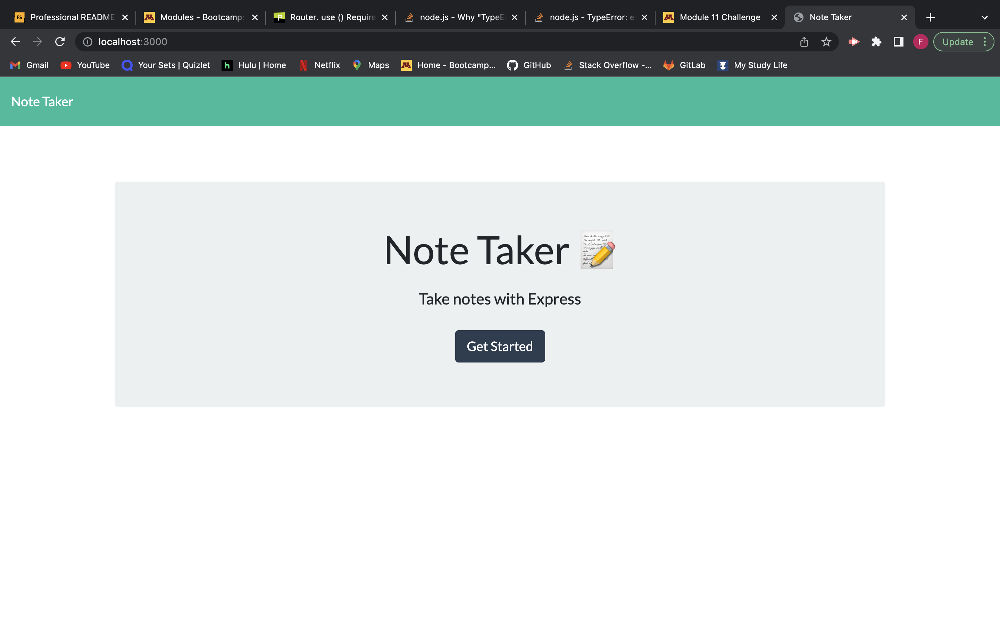

# Note Taker

## Description
This is a simple note taking application app that allows you to save notes with both a title and a text area for you to give a description of what your note it about.

## Table of Contents

- [Installation](#installation)
- [Usage](#usage)
- [Credits](#credits)

## Installation

All you have to do is clone the github repository that will be link down in the [Credits](#credits) section and install all the packages needed for this application and run node server.js in your terminal. 

## Usage

Click the Get Started button where you then will be directed to the page where it gives you a title and description of notes where you can then either save or delete it. 

## Credits

You can find the github repo link on [Fartuun Ali's](https://github.com/afartuun/note_taker) github page!
Here is the [Heroku Link]( https://git.heroku.com/note-taker-fartuun.git)

